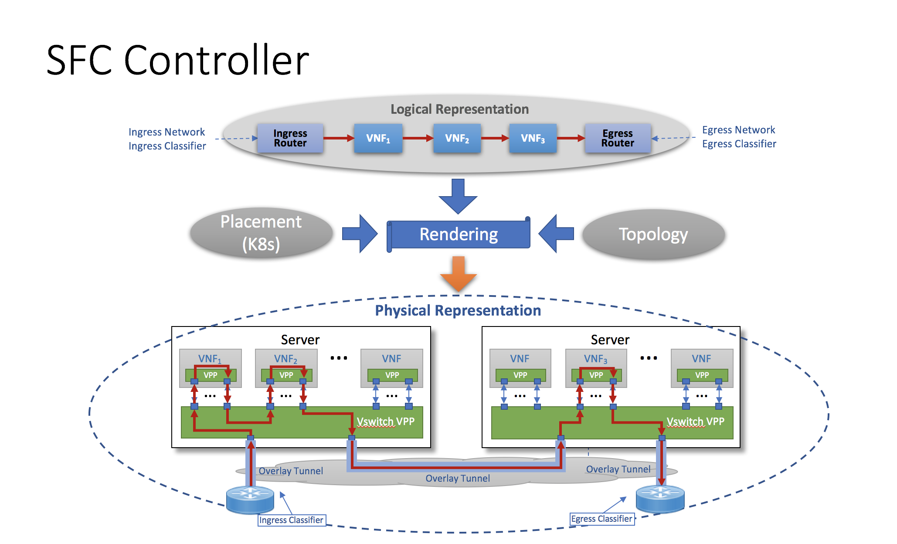
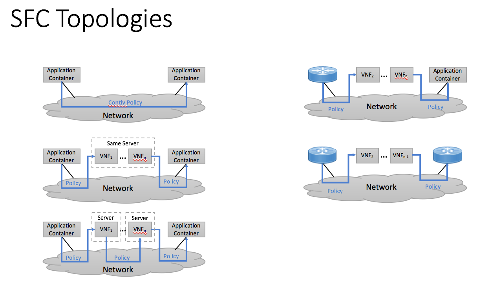

# SFC Controller

[](https://travis-ci.org/ligato/sfc-controller)
[](https://coveralls.io/github/ligato/sfc-controller?branch=master)
[](https://goreportcard.com/report/github.com/ligato/sfc-controller)
[](https://godoc.org/github.com/ligato/sfc-controller)
[](https://github.com/ligato/sfc-controller/blob/master/LICENSE)

Please note that the content of this repository is currently **WORK IN PROGRESS**.

The SFC Controller is a Golang implementation of an orchestration module
for providing data-plane connectivity for cloud native containers.  The
containers may be [Ligato VPP-agent][0] enabled containers which in turn use
[VPP][1] based cloud-native [Virtual Network Functions][2] (VNFs) or the
containers may be application containers communicating via veth interfaces.
The VPP Agent is built on top of the [CN-Infra platform][5] for developing 
cloud-native Virtual Network Functions (VNFs). 

The SFC Controller supports a wide variety of topologies.  The controller can
effect connectivity for containers on-host, inter-host and host to external
router.

## Architecture
The SFC Controller system architecture is shown in the following figure: 



The architecture has the following components:
* **SFC Controller**: can be deployed in its own container and is responsible
for managing the data plane connectivity for a set of hosts, external 
routers and, of course, the containers.  A model of the hosts, external
routers, and chains or sets of containers is given to the SFC controller
either through a yaml config file or via REST api calls.
* **etcd**: the communication of the configuration is done via ETCD.  Each
VPP agent enabled container in the system is responsible for reading its
branch of the ETCD tree.  For non-VPP containers, the VSwitch VPP will
perform the programming of the veth interfaces.  All of the configuration
in the ETCD tree for data-plane connectivity is written to by the SFC
controller.
* **VSwitch VPP** container: there is one of these per host.  This is a special
container that the SFC Controller uses to wire the containers together,
and to wire the containers to external routers and other SFC Controller
controlled hosts.
* **VPP agent containers**: these containers are VPP enabled and have a
[Ligato VPP-agent][0] which controls the VPP in the container.  VNF's are
developed as extensions to [VPP][1].
* **non-VPP containers**: these are application containers which communicate
with other containers or externally via veth interfaces.  The VSwitch VPP
creates the veth interfaces.

## SFC Topologies
The SFC Controller supports the following topologies: 



## Plugins

The SFC controller is written with a plugin architecture so that functionality
can be extended.

The set of plugins in the SFC Controller is as follows:
* [l2_driver][3] - l2 bridge, vxlan tunnel plugin (wire inter-host,
    and host-external router)
* [CN-Infra core][5] - lifecycle management of plugins (loading, 
    initialization, unloading)

## Tools
The SFC Controller repository also contains tools for building and troubleshooting 
of VNFs based on the VPP Agent:

* [sfcdump](cmd/sfcdump) - a CLI tool that shows a raw dump of a set of 
   sfc-controller datastrcutures and VPP agents

## Quickstart
For a quick start with the sfc-controller, you can use pre-built Docker images with
the Agent and VPP on [Dockerhub][6].

0. Start ETCD and Kafka on your host (e.g. in Docker as described [here][7]).
   Note: **The SFC Controller in the pre-built Docker image will not start if it can't 
   connect to both Etcd and Kafka**.  Note: also start the VSwitch VPP.  See the
   [Quickstart VSwitch VPP][8]

1. Run VPP + VPP Agent in a Docker image:
```
docker pull ligato/sfc-controller
docker run -it --name sfc-contoller --rm ligato/sfc-controller
```

2. Dump the the SFC Controller ETCD tree using sfcdump:
```
docker exec -it sfc-controller sfcdump
```

## Documentation
GoDoc can be browsed [online](https://godoc.org/github.com/ligato/sfc-controller).

## Next Steps
Read the README for the [Development Docker Image](docker/dev_sfc_controller/README.md) for more details.


### Deployment:
[](docs/Deployment.md)

## Contribution:
If you are interested in contributing, please see the [contribution guidelines](CONTRIBUTING.md).

[0]: https://github.com/ligato/vpp-agent
[1]: https://fd.io/
[2]: https://github.com/ligato/cn-infra/blob/master/docs/readmes/cn_virtual_function.md
[3]: https://github.com/ligato/sfc-controller/tree/master/controller/cnpdriver
[4]: https://github.com/ligato/cn-infra
[5]: https://github.com/ligato/cn-infra/tree/master/core
[6]: https://hub.docker.com/r/ligato/sfc-controller/
[7]: docker/dev_vpp_agent/README.md#running-etcd-server-on-local-host
[8]: https://github.com/ligato/vpp-agent#quickstart